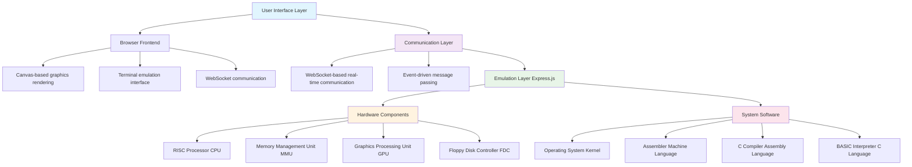

# OrionRisc-128 - System Architecture

## System Architecture Overview

OrionRisc-128 is designed as a modular, component-based system that emulates a complete 1980s computer. The architecture follows a clear separation between hardware emulation, system software, and user interface layers.

## Component Architecture

### Hardware Components

#### 1. RISC Processor (CPU)
- **Location**: `src/emulation/cpu/`
- **Responsibility**: Execute machine instructions, manage registers and program counter
- **Interface**:
  - `execute(instruction)` - Execute single instruction
  - `getRegister(index)` / `setRegister(index, value)` - Register access
  - `getProgramCounter()` / `setProgramCounter(address)` - PC management
- **Implementation**: 32-bit RISC architecture with 16 general-purpose registers

#### 2. Memory Management Unit (MMU)
- **Location**: `src/emulation/memory/`
- **Responsibility**: Manage 128KB RAM, handle memory-mapped I/O
- **Interface**:
  - `readByte(address)` / `writeByte(address, value)` - Memory access
  - `readWord(address)` / `writeWord(address, value)` - Word access
  - `loadMemory(startAddress, data)` - Bulk memory operations
- **Implementation**: 128KB RAM (0x0000-0xFFFF) with memory-mapped I/O regions

#### 3. Graphics Processing Unit (GPU)
- **Location**: `src/emulation/gpu/`
- **Responsibility**: 640x200 monochrome graphics, 80x25 text mode
- **Interface**:
  - `setPixel(x, y, color)` - Draw individual pixels
  - `drawCharacter(x, y, char, foreground, background)` - Text rendering
  - `clearScreen()` - Screen clearing operations
  - `render()` - Frame buffer to display rendering
- **Implementation**: Frame buffer-based rendering with character ROM

#### 4. Floppy Disk Controller (FDC)
- **Location**: `src/emulation/storage/`
- **Responsibility**: Manage two 360KB floppy disk drives
- **Interface**:
  - `mountDisk(drive, diskImage)` - Mount disk images
  - `readSector(drive, track, sector)` - Read disk sectors
  - `writeSector(drive, track, sector, data)` - Write disk sectors
- **Implementation**: FAT12 file system emulation for simple file storage

### System Software Components

#### 5. Operating System Kernel
- **Location**: `src/system/os/`
- **Responsibility**: Program loading, basic I/O, system initialization
- **Interface**:
  - `loadProgram(programPath)` - Load executable programs
  - `executeProgram(entryPoint)` - Execute loaded programs
  - `handleInterrupt(interruptType)` - Interrupt handling
- **Implementation**: Minimal OS providing basic system services

#### 6. Assembler
- **Location**: `src/system/assembler/`
- **Responsibility**: Translate assembly language to machine code
- **Interface**:
  - `assemble(sourceCode)` - Assemble source to machine code
  - `parseInstruction(mnemonic, operands)` - Parse individual instructions
- **Implementation**: Written in machine language (self-hosting)

#### 7. C Compiler
- **Location**: `src/system/compiler/`
- **Responsibility**: Compile C source code to assembly
- **Interface**:
  - `compile(sourceCode)` - Compile C to assembly
  - `parseExpression(expression)` - Expression parsing
  - `generateCode(ast)` - Code generation from AST
- **Implementation**: Written in assembly language

#### 8. BASIC Interpreter
- **Location**: `src/system/interpreter/`
- **Responsibility**: Execute BASIC programs
- **Interface**:
  - `interpret(sourceCode)` - Execute BASIC source
  - `executeStatement(statement)` - Execute individual statements
- **Implementation**: Written in C (compiled)

### User Interface Components

#### 9. Browser Frontend
- **Location**: `src/frontend/`
- **Responsibility**: Visual computer interface, user interaction
- **Components**:
  - Canvas-based graphics display
  - Terminal emulation for text I/O
  - Control panel for system management
  - File browser for disk management

#### 10. Communication Layer
- **Location**: `src/communication/`
- **Responsibility**: Real-time communication between frontend and backend
- **Implementation**: WebSocket-based event system

## Key Technical Decisions

### Bootstrap Development Approach
1. **Phase 1**: Direct machine language programming
2. **Phase 2**: Machine language assembler for assembly development
3. **Phase 3**: Assembly-based C compiler for high-level language development
4. **Phase 4**: C-based BASIC interpreter for user programming

### Modular Design
- Each component has clear interfaces and responsibilities
- Components communicate through well-defined APIs
- Easy to test, debug, and extend individual components

### Event-Driven Architecture
- Hardware emulation uses event-driven updates
- Frontend communicates through asynchronous events
- Supports real-time debugging and inspection

## Critical Implementation Paths

### Development Sequence
1. **CPU Core** - Basic instruction execution engine
2. **Memory System** - RAM and memory-mapped I/O
3. **Graphics Rendering** - Frame buffer and character display
4. **Storage System** - Floppy disk emulation
5. **OS Kernel** - Program loading and execution
6. **Assembler** - Self-hosting assembly development
7. **C Compiler** - Cross-compilation to assembly
8. **BASIC Interpreter** - High-level user interface
9. **Frontend Interface** - Visual computer emulation

### Testing Strategy
- Unit tests for individual components
- Integration tests for component interactions
- System tests for complete functionality
- Bootstrap validation at each development phase